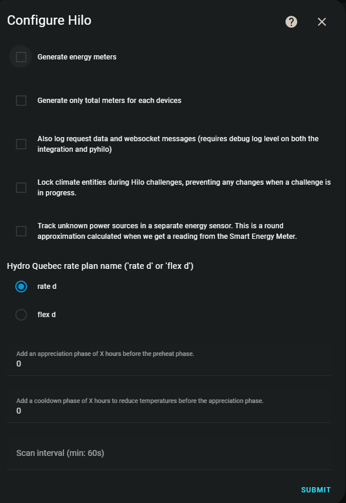

[![Français][Françaisshield]][Français]
[![English][Englishshield]][English]

[![hacs][hacsbadge]][hacs]
[![GitHub Release][releases-shield]][releases]
[![GitHub Activity][commits-shield]][commits]
[![Project Maintenance][maintenance-shield]][user_profile]
[![License][license-shield]][license]
[![pre-commit][pre-commit-shield]][pre-commit]
[![black][black-shield]][black]
[![calver][calver-shield]][calver]
[![discord][discord-shield]][discord]

**BETA**

This is a Beta version. There will likely be bugs, issues, etc. Thank you for your patience and for opening "Issues".


## 📌 Introduction
This unofficial HACS integration allows you to use [Hilo](https://www.hiloenergie.com/fr-ca/) with Home Assistant. **It is not affiliated with Hilo or Hydro-Québec.**

**⚠️ Do not contact Hilo or Hydro-Québec for issues related to this integration.**

**⚠️ Please make your automations and API calls smartly — Hilo knows we’re here and lets us have access because we don’t abuse it, let’s keep it that way.**

🔗 [Recommended minimum configuration](https://github.com/dvd-dev/hilo/wiki/FAQ-%E2%80%90-Français#avez-vous-une-configuration-recommandée)
🔗 Blueprints: [NumerID](https://github.com/NumerID/blueprint_hilo) | [Arim215](https://github.com/arim215/ha-hilo-blueprints)
🔗 YAML automation examples: [Automations](https://github.com/dvd-dev/hilo/tree/main/doc/automations)
🔗 Lovelace interface examples: [Interfaces](https://github.com/dvd-dev/hilo/wiki/Utilisation)

---

## 🔥 Main Features
✅ Supports switches and dimmers as lights

✅ Thermostat control and temperature reading

✅ Energy consumption monitoring of Hilo devices

✅ Sensor for Hilo challenges and gateway

✅ Configuration via user interface

✅ Authentication via Hilo website

✅ Outdoor weather sensor with changing icon


📌 **To do**: Support for other devices, improvement of consumption meters, API documentation

# ⚠️ Hilo Challenge Sensor ⚠️

### Current State:
- The `allowed_kWh` and `used_kWh` attributes are **partially functional**: the information arrives in fragments, and not all cases are handled yet.
- Some information, such as `total_devices`, `opt_out_devices`, and `pre_heat_devices`, do not **persist in memory**.

---

## 📥 Installation
### 1️⃣ Check Compatibility
- The integration requires Hilo hardware installed and functional.
- Tested on HA OS, Docker (ghcr.io), Podman. Other configurations may cause issues.
- Ongoing issue on Podman/Kubernetes see [issue #497](https://github.com/dvd-dev/hilo/issues/497).

### 2️⃣ File Installation
#### 🔹 Option 1: Via HACS
[](https://my.home-assistant.io/redirect/hacs_repository/?owner=dvd-dev&repository=hilo&category=integration)

1. Make sure you have [HACS](https://hacs.xyz/docs/use/download/download/) installed.
2. In HACS, click `+ EXPLORE & DOWNLOAD REPOSITORIES`, search for "Hilo" and download it.
3. Restart Home Assistant

#### 🔹 Option 2: Manually
1. Download the latest version from [GitHub](https://github.com/dvd-dev/hilo/releases/latest).
2. Copy `custom_components/hilo` to Home Assistant's `custom_components` folder.
3. Restart Home Assistant

### 3️⃣ Add Integration to Home Assistant
[](https://my.home-assistant.io/redirect/config_flow_start/?domain=hilo)

1. Go to **Settings > Devices & Services > Integrations**.
2. Click `+ ADD INTEGRATION` and search for "Hilo".
3. Authenticate on the Hilo website and link your account.

---

## 📌 Power Consumption Tracking
If you want to use automatic generation of power consumption sensors, follow these steps:

1. **Add the `utility_meter` platform**
   Add the following line to your `configuration.yaml`:
   ```yaml
   utility_meter:
   ```

2. **Enable automatic generation**
   - In the integration's user interface, click `Configure`.
   - Check **Generate power consumption meters**.

3. *(Optional)* **Restart Home Assistant**
   - Wait about 5 minutes. The `sensor.hilo_energy_total_low` entity will be created and contain data.
   - **The `status`** should be `collecting`.
   - **The `state`** should be a number greater than 0.
   - All created entities and sensors will be prefixed or suffixed with `hilo_energy_` or `hilo_rate_`.

4. **Known error (to ignore)**
   If you see this error in the Home Assistant log, it can be ignored:
   ```
   2021-11-29 22:03:46 ERROR (MainThread) [homeassistant] Error doing job: Task exception was never retrieved
   Traceback (most recent call last):
   [...]
   ValueError: could not convert string to float: 'None'
   ```

5. **Manual addition to "Energy" dashboard**
   Once created, meters will need to be added manually.

---

## ⚠️ Warning
When activating meters, it is recommended to **remove old manual sensors** to avoid duplicate data.

If you encounter a problem and want to collaborate, enable **debug** logging and provide an excerpt from the `home-assistant.log` file. The method is explained below.

---

## ⚙️ Other Configuration Options
You can configure additional options by clicking `Configure` in Home Assistant:

### ✅ **Generate power consumption meters**
- Automatically generates power consumption meters.
- **Requires** the following line in `configuration.yaml`:
  ```yaml
  utility_meter:
  ```

### ✅ **Generate only total meters for each device**
- Calculates only the total energy **without division** between low and high cost.

### ✅ **Log request data and Websocket messages**
- Requires **debug logging level** on the integration and `pyhilo`.
- Allows detailed tracking for development and debugging.

### ✅ **Lock `climate` entities during Hilo challenges**
- Prevents any modification of temperature setpoints **during a challenge** Hilo.

### ✅ **Track unknown consumption sources in a separate meter**
- All **non-Hilo** sources are grouped in a dedicated sensor.
- Uses the house's **smart meter** reading.

### 📌 **Hydro-Québec rate name** (`rate d` or `flex d`)
- Define the **rate plan name**.
- **Supported values**:
  - `'rate d'`
  - `'flex d'`

### ⏳ **Update interval (min: 60s)**
- Sets the **number of seconds** between each update.
- **Default value**: `60s`.
- **Don't go below 30s** to avoid suspension from Hilo.
- Since **2023.11.1**, the minimum has increased from **15s to 60s**.

## 📌 FAQ and Support
🔗 [Complete FAQ](https://github.com/dvd-dev/hilo/wiki/FAQ)
💬 Join the community on [Discord](https://discord.gg/MD5ydRJxpc)

**Problems?** Open an "Issue" with `debug` logs enabled in `configuration.yaml`:
```yaml
logger:
  default: info
  logs:
     custom_components.hilo: debug
     pyhilo: debug
```

# 👥 Initial Contributors

- **[Francis Poisson](https://github.com/francispoisson/)**
- **[David Vallee Delisle](https://github.com/valleedelisle/)**

## 🎖️ Very Honorable Mentions

- **[Ian Couture](https://github.com/ic-dev21/)**: He has been maintaining this addon for some time.
- **[Hilo](https://www.hiloenergie.com)**: Thanks to Hilo for their support and contributions.

---
💡 **Want to contribute?** Check out the [contribution section](/CONTRIBUTING.md) to see how to help with the project.

[integration_blueprint]: https://github.com/custom-components/integration_blueprint
[commits-shield]: https://img.shields.io/github/commit-activity/y/dvd-dev/hilo.svg?style=for-the-badge
[commits]: https://github.com/dvd-dev/hilo/commits/main
[hacs]: https://hacs.xyz
[hacsbadge]: https://img.shields.io/badge/HACS-Default-41BDF5.svg?style=for-the-badge
[license]: https://github.com/dvd-dev/hilo/blob/main/LICENSE
[license-shield]: https://img.shields.io/github/license/dvd-dev/hilo.svg?style=for-the-badge
[maintenance-shield]: https://img.shields.io/badge/maintainer-%40dvd--dev-blue.svg?style=for-the-badge
[releases-shield]: https://img.shields.io/github/release/dvd-dev/hilo.svg?style=for-the-badge
[releases]: https://github.com/dvd-dev/hilo/releases
[user_profile]: https://github.com/dvd-dev
[pre-commit-shield]: https://img.shields.io/badge/pre--commit-enabled-brightgreen?logo=pre-commit&logoColor=white&style=for-the-badge
[pre-commit]: https://github.com/pre-commit/pre-commit
[calver-shield]: https://img.shields.io/badge/calver-YYYY.MM.Micro-22bfda.svg?style=for-the-badge
[calver]: http://calver.org/
[black-shield]: https://img.shields.io/badge/code%20style-black-000000.svg?style=for-the-badge
[black]: https://github.com/psf/black
[discord-shield]: https://img.shields.io/badge/discord-Chat-green?logo=discord&style=for-the-badge
[discord]: https://discord.gg/MD5ydRJxpc
[Englishshield]: https://img.shields.io/badge/en-English-red?style=for-the-badge
[English]: https://github.com/dvd-dev/hilo/blob/main/README.en.md
[Françaisshield]: https://img.shields.io/badge/fr-Français-blue?style=for-the-badge
[Français]: https://github.com/dvd-dev/hilo/blob/main/README.md
