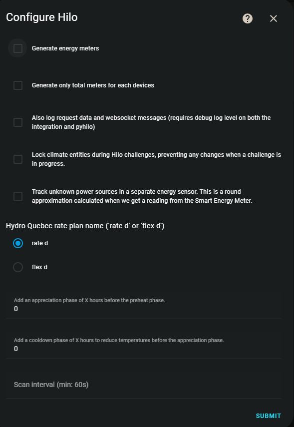

[![Français][Françaisshield]][Français]
[![English][Englishshield]][English]

[![hacs][hacsbadge]][hacs]
[![GitHub Release][releases-shield]][releases]
[![GitHub Activity][commits-shield]][commits]
[![Project Maintenance][maintenance-shield]][user_profile]
[![License][license-shield]][license]
[![pre-commit][pre-commit-shield]][pre-commit]
[![black][black-shield]][black]
[![calver][calver-shield]][calver]
[![discord][discord-shield]][discord]
[![Installations (analytics)][installs-shield]][analytics]

# ⚠️ BREAKING CHANGE ⚠️

Hilo ferme endpoint API /Devices. Voir issue #564.

Nous avons relâchés v2026.3.2. Toutes les installations qui n'auront pas passé à cette version ne fonctionneront plus au niveau des lectures d'appareils.

Un bug s'est glissé dans v2026.3.2 et v2026.3.3: lors d'un reload ou d'une déconnexion le sensor défi ne revient pas.
Corrigé dans v2026.3.4.

Tout issue ouvert par quelqu'un qui n'a pas mis à jour Hilo sera fermé.

# ⚠️ BREAKING CHANGE ⚠️

**BETA**

Ceci est une version Bêta. Il y aura probablement des bogues, irritants, etc. Merci pour votre patience et d'ouvrir des "Issues".

Merci de consulter le [Wiki](https://github.com/dvd-dev/hilo/wiki) avant de créer des "Issues", plusieurs questions communes s'y trouvent.

# Hilo - Home Assistant
Intégration pour Home Assistant d'[Hilo](https://www.hiloenergie.com/fr-ca/)


## 📌 Introduction
Cette intégration non-officielle HACS permet d'utiliser [Hilo](https://www.hiloenergie.com/fr-ca/) avec Home Assistant. **Elle n'est pas affiliée à Hilo ou Hydro-Québec.**

**⚠️ Ne contactez pas Hilo ou Hydro-Québec pour les problèmes liés à cette intégration.**

**⚠️ Merci de faire vos automatisations et call d'API intelligemment, Hilo sait qu'on est là et nous laisse accès parce que l'on n'abuse pas, gardons ça comme ça.**

🔗 [Configuration minimale recommandée](https://github.com/dvd-dev/hilo/wiki/FAQ-%E2%80%90-Français#avez-vous-une-configuration-recommandée)
🔗 Blueprints : [NumerID](https://github.com/NumerID/blueprint_hilo) | [Arim215](https://github.com/arim215/ha-hilo-blueprints)
🔗 Exemples d'automatisations YAML : [Automatisations](https://github.com/dvd-dev/hilo/tree/main/doc/automations)
🔗 Exemples d'interfaces Lovelace : [Interfaces](https://github.com/dvd-dev/hilo/wiki/Utilisation)

---

## 🔥 Fonctionnalités principales
✅ Supporte les interrupteurs et gradateurs comme lumières

✅ Contrôle des thermostats et lecture des températures

✅ Suivi de la consommation énergétique des appareils Hilo

✅ Sensor pour les défis et la passerelle Hilo

✅ Configuration via l'interface utilisateur

✅ Authentification via le site web d'Hilo

✅ Capteur météo extérieure avec icône changeante

📌 **À faire** : Support d'autres appareils, amélioration des compteurs de consommation, documentation API

# ⚠️ Sensor défi Hilo ⚠️

### Ce qui reste à faire de ce côté:
- Les attributs `allowed_kWh` et `used_kWh` sont **partiellement fonctionnels** actuellement, les informations arrivent morcelées et tous
les cas ne sont pas traités encore.
- Certaines informations comme `total_devices`, `opt_out_devices` et `pre_heat_devices` ne persistent pas en mémoire.

---

## 📥 Installation
### 1️⃣ Vérifier la compatibilité
- L'intégration nécessite le matériel Hilo installé et fonctionnel.
- Testée sous HA OS, Docker (ghcr.io), Podman. D'autres configurations peuvent poser problèmes.
- Problème connu sur Podman/Kubernetes see [issue #497](https://github.com/dvd-dev/hilo/issues/497).

### 2️⃣ Installation des fichiers
#### 🔹 Option 1 : Via HACS
[](https://my.home-assistant.io/redirect/hacs_repository/?owner=dvd-dev&repository=hilo&category=integration)

1. Assurez-vous d'avoir [HACS](https://hacs.xyz/docs/use/download/download/) installé.
2. Dans HACS, cliquez sur `+ EXPLORE & DOWNLOAD REPOSITORIES`, recherchez "Hilo" et téléchargez-le.
3. Redémarrer Home Assistant

#### 🔹 Option 2 : Manuellement
1. Téléchargez la dernière version depuis [GitHub](https://github.com/dvd-dev/hilo/releases/latest).
2. Copiez `custom_components/hilo` dans le dossier `custom_components` de Home Assistant.
3. Redémarrer Home Assistant

### 3️⃣ Ajouter l'intégration à Home Assistant
[](https://my.home-assistant.io/redirect/config_flow_start/?domain=hilo)

1. Allez à **Paramètres > Appareils et services > Intégrations**.
2. Cliquez sur `+ AJOUTER UNE INTÉGRATION` et recherchez "Hilo".
3. Authentifiez-vous sur le site web d'Hilo et liez votre compte.

---

## 📌 Suivis de la consommation électrique
Si vous souhaitez utiliser la génération automatique des capteurs de consommation électrique, suivez ces étapes :

1. **Ajouter la plateforme `utility_meter`**
   Ajoutez la ligne suivante dans votre fichier `configuration.yaml` :
   ```yaml
   utility_meter:
   ```

2. **Activer la génération automatique**
   - Dans l'interface utilisateur de l'intégration, cliquez sur `Configurer`.
   - Cochez **Générer compteurs de consommation électrique**.

3. *(Optionnel)* **Redémarrer Home Assistant**
   - Attendez environ 5 minutes. L'entité `sensor.hilo_energy_total_low` sera créée et contiendra des données.
   - **Le `status`** devrait être `collecting`.
   - **L'état `state`** devrait être un nombre supérieur à 0.
   - Toutes les entités et capteurs créés seront préfixés ou suffixés par `hilo_energy_` ou `hilo_rate_`.

4. **Erreur connue (à ignorer)**
   Si vous voyez cette erreur dans le journal de Home Assistant, elle peut être ignorée :
   ```
   2021-11-29 22:03:46 ERROR (MainThread) [homeassistant] Error doing job: Task exception was never retrieved
   Traceback (most recent call last):
   [...]
   ValueError: could not convert string to float: 'None'
   ```

5. **Ajout manuel au tableau de bord "Énergie"**
   Une fois créés, les compteurs devront être ajoutés manuellement.

---

## ⚠️ Avertissement
Lorsque l'on active les compteurs, il est recommandé de **retirer les anciens capteurs manuels** afin d'éviter des données en double.

Si vous rencontrez un problème et souhaitez collaborer, activez la journalisation **debug** et fournissez un extrait du fichier `home-assistant.log`. La méthode est expliquée ci-dessous.

---

## ⚙️ Autres options de configuration
Vous pouvez configurer des options supplémentaires en cliquant sur `Configurer` dans Home Assistant :

### ✅ **Générer compteurs de consommation électrique**
- Génère automatiquement les compteurs de consommation électrique.
- **Nécessite** la ligne suivante dans `configuration.yaml` :
  ```yaml
  utility_meter:
  ```

### ✅ **Générer seulement les compteurs totaux pour chaque appareil**
- Calcule uniquement le total d'énergie **sans division** entre coût faible et coût élevé.

### ✅ **Enregistrer les données de demande et les messages Websocket**
- Nécessite un **niveau de journalisation `debug`** sur l'intégration et `pyhilo`.
- Permet un suivi détaillé pour le développement et le débogage.

### ✅ **Verrouiller les entités `climate` lors des défis Hilo**
- Empêche toute modification des consignes de température **pendant un défi** Hilo.

### ✅ **Suivre des sources de consommation inconnues dans un compteur séparé**
- Toutes les sources **non Hilo** sont regroupées dans un capteur dédié.
- Utilise la lecture du **compteur intelligent** de la maison.

### 📌 **Nom du tarif Hydro-Québec** (`rate d` ou `flex d`)
- Définissez le **nom du plan tarifaire**.
- **Valeurs supportées** :
  - `'rate d'`
  - `'flex d'`

### ⏳ **Intervalle de mise à jour (min : 60s)**
- Définit le **nombre de secondes** entre chaque mise à jour.
- **Valeur par défaut** : `60s`.
- **Ne pas descendre sous 30s** pour éviter une suspension de Hilo.
- Depuis **2023.11.1**, le minimum est passé de **15s à 60s**.


## 📌 FAQ et support
🔗 [FAQ complète](https://github.com/dvd-dev/hilo/wiki/FAQ)
💬 Rejoignez la communauté sur [Discord](https://discord.gg/MD5ydRJxpc)

**Problèmes ?** Ouvrez une "Issue" avec les logs `debug` activés dans `configuration.yaml` :
```yaml
logger:
  default: info
  logs:
     custom_components.hilo: debug
     pyhilo: debug
```

---


# 👥 Collaborateurs initiaux

- **[Francis Poisson](https://github.com/francispoisson/)**
- **[David Vallee Delisle](https://github.com/valleedelisle/)**

## 🎖️ Mentions très honorables

- **[Ian Couture](https://github.com/ic-dev21/)** : Il maintient cet addon depuis un certain temps.
- **[Hilo](https://www.hiloenergie.com)** : Merci à Hilo pour son soutien et ses contributions.

---
💡 **Envie de contribuer ?** Consultez la [section contribution](/CONTRIBUTING.md) pour voir comment aider au projet.


[integration_blueprint]: https://github.com/custom-components/integration_blueprint
[commits-shield]: https://img.shields.io/github/commit-activity/y/dvd-dev/hilo.svg?style=for-the-badge
[commits]: https://github.com/dvd-dev/hilo/commits/main
[hacs]: https://hacs.xyz
[hacsbadge]: https://img.shields.io/badge/HACS-Default-41BDF5.svg?style=for-the-badge
[license]: https://github.com/dvd-dev/hilo/blob/main/LICENSE
[license-shield]: https://img.shields.io/github/license/dvd-dev/hilo.svg?style=for-the-badge
[maintenance-shield]: https://img.shields.io/badge/maintainer-%40dvd--dev-blue.svg?style=for-the-badge
[releases-shield]: https://img.shields.io/github/release/dvd-dev/hilo.svg?style=for-the-badge
[releases]: https://github.com/dvd-dev/hilo/releases
[user_profile]: https://github.com/dvd-dev
[pre-commit-shield]: https://img.shields.io/badge/pre--commit-enabled-brightgreen?logo=pre-commit&logoColor=white&style=for-the-badge
[pre-commit]: https://github.com/pre-commit/pre-commit
[calver-shield]: https://img.shields.io/badge/calver-YYYY.MM.Micro-22bfda.svg?style=for-the-badge
[calver]: http://calver.org/
[black-shield]: https://img.shields.io/badge/code%20style-black-000000.svg?style=for-the-badge
[black]: https://github.com/psf/black
[discord-shield]: https://img.shields.io/badge/discord-Chat-green?logo=discord&style=for-the-badge
[discord]: https://discord.gg/MD5ydRJxpc
[Englishshield]: https://img.shields.io/badge/en-English-red?style=for-the-badge
[English]: https://github.com/dvd-dev/hilo/blob/main/README.en.md
[Françaisshield]: https://img.shields.io/badge/fr-Français-blue?style=for-the-badge
[Français]: https://github.com/dvd-dev/hilo/blob/main/README.md
[installs-shield]: https://img.shields.io/badge/dynamic/json?url=https://analytics.home-assistant.io/custom_integrations.json&query=$.hilo.total&label=Installations%20(analytics)&color=blue
[analytics]: https://analytics.home-assistant.io/custom_integrations.json


